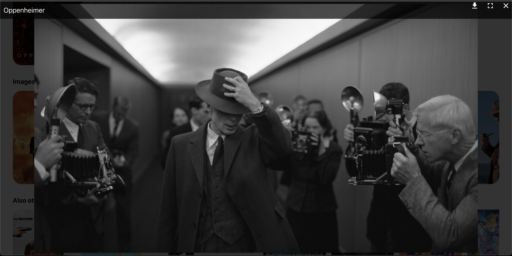
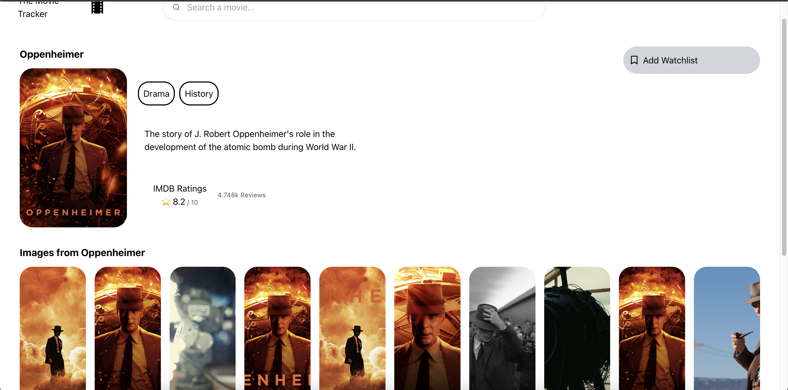
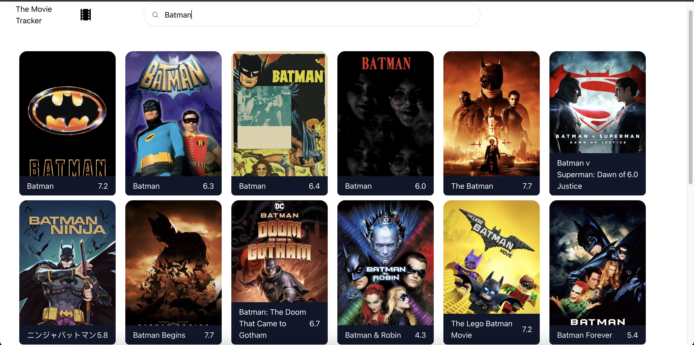

<h2>TMDB Movie App ⭐️</h2>

Here is Movie App with tmdb api you can search for movies

You can search, look up for details and see related other movies

<h4>API Reference</h4> <a href="https://developer.themoviedb.org/docs">themoviedb.org</a>

 
 
 

In this project i used:

<ul>
<li>React.js</li>
<li>Tailwind</li>
<li>React Router v6</li>
<li>React Icons</li>
<li>React use-draggable-scroll</li>
<li>React Modal Image</li>
<u/l>

⭐️
